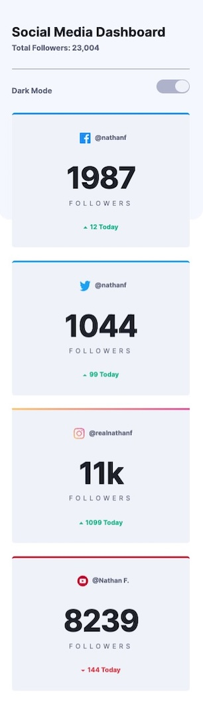
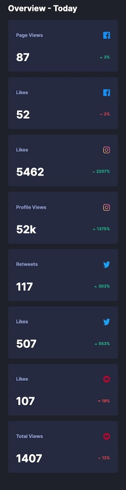

# Frontend Mentor - Social media dashboard with theme switcher solution

This is a solution to the [Social media dashboard with theme switcher challenge on Frontend Mentor](https://www.frontendmentor.io/challenges/social-media-dashboard-with-theme-switcher-6oY8ozp_H). Frontend Mentor challenges help you improve your coding skills by building realistic projects. 

## Table of contents

- [Overview](#overview)
  - [The challenge](#the-challenge)
  - [Screenshot](#screenshot)
  - [Links](#links)
- [My process](#my-process)
  - [Built with](#built-with)
- [Author](#author)
- [Acknowledgments](#acknowledgments)

## Overview

### The challenge

Users should be able to:

- View the optimal layout for the site depending on their device's screen size
- See hover states for all interactive elements on the page
- Toggle color theme to their preference

### Screenshot

 

### Links

- Solution URL: [Zacharycampanelli/Social-Media-Dashboard](https://github.com/Zacharycampanelli/Social-Media-Dashboard)
- Live Site URL: [Add live site URL here](https://your-live-site-url.com)

## My process

### Built with

- Flexbox
- Mobile-first workflow
- React
- Vite
- Sass
- [Gerillass](https://gerillass.com/) - Sass Mixin Library
- [useHooks](https://usehooks.com/) - React Hook Library
- Netlify

## Author

- GitHub: [Zacharycampanelli](https://github.com/Zacharycampanelli)
- Frontend Mentor - [@Zacharycampanelli](https://www.frontendmentor.io/profile/Zacharycampanelli)
- Email: [zaccamp@optonline.net](mailto:zaccamp@optonline.net)

## Acknowledgments

- [Frontend Mentor](https://www.frontendmentor.io)
- [Tenacity_Dev](https://www.youtube.com/@tenacity_dev) - For awesome tutorial on how to implement themes in SASS
